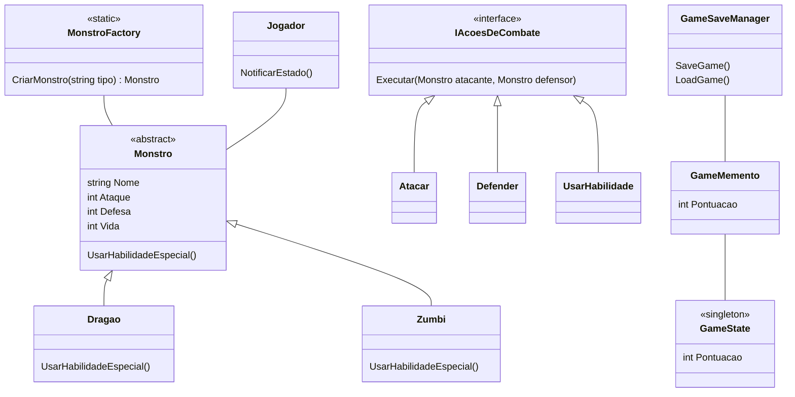

# 🎮 ConsoleAppMonstro - Batalha de Monstros no Console!

[](https://dotnet.microsoft.com/en-us/download/dotnet/8.0)
[](https://xunit.net/)

Bem-vindo ao **ConsoleAppMonstro**, um jogo de batalha de monstros baseado em turnos, criado com **C#** e **.NET 8.0**! Divirta-se enfrentando duelos épicos enquanto explora a aplicação prática de padrões de design de software. 🐉💥🧟

---

## 📖 Visão Geral do Jogo

**ConsoleAppMonstro** é um jogo em que dois jogadores escolhem seus monstros e alternam entre turnos para realizar ações como:

- **Atacar**
- **Defender**
- **Usar habilidades especiais**

A batalha continua até que a vida de um dos monstros chegue a **zero**. Além disso, o jogo possui um sistema de **salvar/carregar**, permitindo continuar de onde parou.

---

## 🛠️ Padrões de Projeto Implementados

Para um código limpo, modular e extensível, este projeto utiliza os seguintes padrões:

- **Factory (MonstroFactory):** Facilita a criação de novos tipos de monstros sem modificar o cliente.
- **Strategy (IAcoesDeCombate):** Define ações de combate intercambiáveis, como atacar, defender e usar habilidades.
- **Memento (GameMemento, GameSaveManager):** Permite salvar e restaurar estados do jogo sem violar o encapsulamento.
- **Singleton (GameState):** Garante uma única instância do estado do jogo.
- **Observer (Jogador):** Notifica mudanças no estado do jogo, como a vida dos monstros.

---

## 📊 Diagrama de Classes Simplificado



---

## 🚀 Tecnologias Utilizadas

- **[.NET 8.0](https://dotnet.microsoft.com/en-us/download/dotnet/8.0):** Plataforma robusta para criar aplicações modernas.
- **[C#](https://learn.microsoft.com/pt-br/dotnet/csharp/):** Linguagem orientada a objetos e segura.
- **[xUnit](https://xunit.net/):** Framework para testes unitários confiáveis.

---

## ▶️ Como Executar

1. **Pré-requisitos:** Tenha o [**.NET 8.0 SDK**](https://dotnet.microsoft.com/en-us/download/dotnet/8.0) instalado.
2. **Clone o Repositório:**  
   ```bash
   git clone https://github.com/LucasMBA10/Projeto-Game
   ```
3. **Acesse o Diretório:**  
   ```bash
   cd ConsoleAppMonstro
   ```
4. **Execute o Jogo:**  
   ```bash
   dotnet run
   ```

---

## ✅ Como Rodar os Testes

1. **Acesse a Pasta de Testes:**  
   ```bash
   cd Tests
   ```
2. **Execute os Testes:**  
   ```bash
   dotnet test
   ```

---

## 🌟 Próximos Passos e Melhorias Futuras

- Novos monstros com habilidades exclusivas. 🐾✨
- Inteligência Artificial aprimorada para oponentes. 🤖
- Interface gráfica (WinForms, WPF ou Console GUI). 🖥️
- Sistema de níveis e experiência para progressão dos jogadores. 📈
- Balanceamento refinado para maior diversão. ⚖️

---

🎉 **Divirta-se batalhando e aprendendo com o ConsoleAppMonstro!**

---